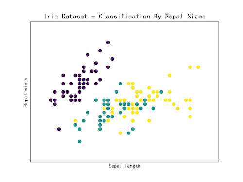
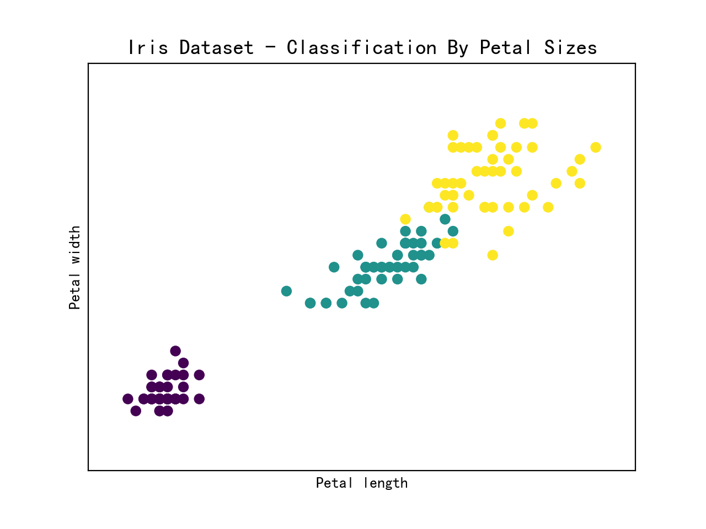
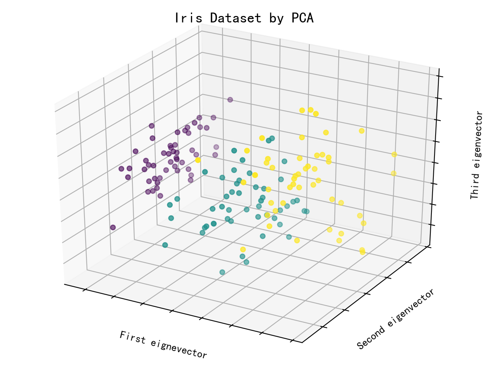

# 数据分析学习笔记
该文件夹主要涉及 scikit-learn 库的运用。其中的代码和部分笔记摘自《Python 数据分析实战》（Fabio Nelli 著，杜春晓译，人民邮电出版社）。
环境准备：在 python3 中下载 scikit-learn 和 matplotlib 包，numpy 包应该会在下载 scikit-learn 时自动下载，若下载出现问题可以查看我的一篇文章<a href="https://www.cnblogs.com/zhenqichai/p/fix-pip-install-sklearn-problem.html">《Python：安装sklearn包出现错误的解决方法》</a>。

根据数据和所要创建的模型的类型，学习问题可以分为两大类：**有监督学习**和**无监督学习**。

## 有监督学习
训练集好汉作为预测结果的额外的属性信息。这些信息可以这哦模型对新数据作出跟已有数据类似的预测结果。

## 用 scikit-learn 实现有监督学习

### 利用 scikit-learn 中的 Iris 数据集学习

1. 根据鸢尾花的萼片长宽分类
运行`python3 iris_sepal.py`，得到以下结果。

 

2. 根据鸢尾花的花瓣长宽分类
运行`python3 iris_petal.py`，得到以下结果。

 

3. 主成分分析法（Principal Component Analysis, PCA）。该方法可以减少系统的维度，保留足以描述各数据点特征的信息，其中新生成的各维叫作主成分。
运行`python3 iris_PCA.py`，得到以下结果。

 

